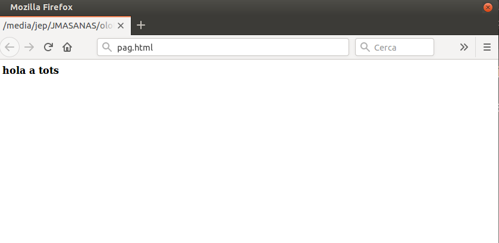
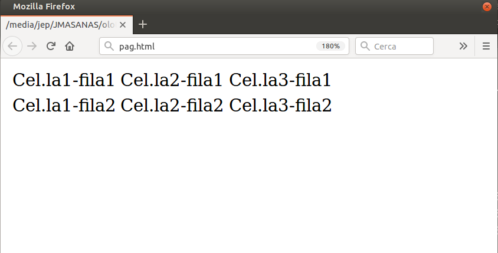

# Llenguatge HTML

## Introducció

El **llenguatge HTML (HyperText Markup Language)** és el llenguatge amb el qual s'escriuen les pàgines web.

L'any 1989 **Tim Berners-Lee** i **Anders Berglund**, dos investigadors del [CERN](https://ca.wikipedia.org/wiki/Organitzaci%C3%B3_Europea_per_a_la_Recerca_Nuclear), van crear un llenguatge  basat en etiquetes destinat a compartir informació per Internet: **HTML**.

Les pàgines web són vistes pels usuaris mitjançant un tipus d'aplicació anomenat **navegador**.

El llenguatge HTML està pensat per compartir documents de manera que es vegin de forma semblant en diferents navegadors.

Conseqüentment, el **llenguatge HTML** serveix al navegador per mostrar les pàgines a l'usuari.

**HTML** ha sofert molts canvis al llarg del temps.

La versió actual del llenguatge HTML és **HTML5**.


També existeix l'**XHTML**, que és, bàsicament, HTML expressat com XML vàlid. No és gaire utilitzat.

### Què és una pàgina web?

Una **pàgina web** és un arxiu de text amb extensió *.html* o *.htm*.

Pot ser creada amb el bloc de notes o programes Editors de codi HTML.

**HTML** és únicament text pla.

### Sintaxis HTML

El **llenguatge HTML** base la seva sintaxis en un element de base que anomenem **etiqueta**.

Una obertura de forma general `<etiqueta>` Un tancament de tipus `</etiqueta>` .

Tot el que estigui dintre d'aquesta etiqueta tindrà les modificacions que caracteritzen aquesta etiqueta.

```html
<b>Hola a tots.</b>
```

El resultat serà:



Però tot i que funciona, no és el que busquem, falta especificar molt millor les parts de la pàgina i la sintaxi de les etiquetes.

El llenguatge HTML té **número d'etiquetes limitat**. Cada etiqueta està pensada per representar documents d'una forma determinada o per marcar-ne l'estructura.

Aquí hi trobaràs una llista d'**etiquetes vàlides**: https://www.w3schools.com/TAGS/default.asp


## Creació de documents HTML

### L'etiqueta DOCTYPE

Tot document **HTML5** ha de començar definint el **DOCTYPE**.

L'etiqueta **DOCTYPE** serveix per indica al programa client (navegador) amb quina sintaxi s'ha creat la pàgina, és una sentencia que es posa al principi de tot de la pàgina.

El **DOCTYPE** s'ha de posar a la primera línia. DOCTYPE a HTML5:

`<!DOCTYPE html>`

### L'etiqueta html

Un document HTML ha d'estar delimitat per l'etiqueta `<html>` i `</html>`.

Pot incloure l'atribut **lang**. **lang** ens permet definir l'idioma en el que està la pàgina. Aquesta informació és important pels motors de cerca i els programes de síntesis de veu.

```html
<!DOCTYPE html>
<html lang="ca">

     ... 

</html>
```

### Parts d'un document HTML

Dins la pàgina HTML podem distingir-hi **dues parts**:

#### L'encapçalament 
* Flanquejat per les etiquetes `<head>` i `</head>` 
* Dóna informació sobre la pàgina.
* Col·locarem etiquetes de tipus informatiu, com per exemple el títol de la pàgina, autor, paraules clau.
* **No es mostra en el navegador.**

#### El cos
* Flanquejat per les etiquetes `<body>` i `</body>` 
* Col·locarem el nostre contingut de la pàgina.
* **És el que es veu realment.**

## Les metadades

L'etiqueta `<meta>` serveix per afegir informació sobre la pàgina i es posen dins el `<head>`.

Els buscadors consultes l'informació d'aquesta etiqueta per millorar la seva cerca i indexació.

Conté els atributs *name* i *content*

```html
<head>
  <meta charset="UTF-8">
  <meta name="description" content="Free Web tutorials">
  <meta name="keywords" content="HTML,CSS,XML,JavaScript">
  <meta name="author" content="John Doe">
  <meta name="viewport" content="width=device-width, initial-scale=1.0">
</head>
```

És important definir el joc de caràcters utilitzat.

* El **joc de caràcters** determina la forma en què els caràcters es converteixen en bytes (i viceversa).
* El W3C recomana el charset **UTF-8**.

### Pàgina HTML bàsica

```html
<!DOCTYPE html>
<html lang="ca">
     <head>
         <title>Hola món!</title>
         <meta charset="UTF-8">
     </head>
     <body>
          ...
     </body>
</html>

```

## Títols

HTML defineix **6 nivells de capçaleres o títols**.

```html
<h1>Títol 1</h1>
<h2>Títol 2</h2>
<h3>Títol 3</h3>
<h4>Títol 4</h4>
<h5>Títol 5</h5>
<h6>Títol 6</h6>
```

**Més informació**: w3schools HTML Headings https://www.w3schools.com/html/html_headings.asp

## Paràgrafs

Per definir els **paràgrafs** utilitzem l'etiqueta `<p>`, la qual introdueix una línia en blanc després del paràgraf.

L'etiqueta `<br>` la qual no té tancament, ens serveix per fer un salt de línia, dins dels paràgrafs.

> ⚠️ No utilitzar les etiquetes antigues que permetien indicar l'alineació del text. Com veurem més endavant, l'estil s'ha de definir amb CSS.

## L'etiqueta pre

L'etiqueta `<pre>` defineix un paràgraf que respecte els codis propis del text pla (intros, número d'espais, etc.).

Adequat per fer textos literals, per exemple els poemes amb els seus salts de línia sense `<br>`.

[Exemple](https://www.w3schools.com/html/tryit.asp?filename=tryhtml_pre)

## Etiquetes de text

Serveixen per indicar que un text concret té un significat especial.

* `<strong></strong>`: Text important (es mostra en negreta): 
* `<em></em>` (emphasized): Text emfatitzat (es mostra en cursiva)
* `<blockquote></blockquote>`: per cites (es mostra tabulat). [Exemple](https://www.w3schools.com/html/html_quotation_elements.asp)

> ⚠️ Es recomana evitar etiquetes sense significat, que només indiquen estil: `<b>`, `<i>`, `<u>`, `<sup>``, `<sub>`. **Sempre** hem de formatar el contingut mitjançant les **fulles d'estil (CSS)**.

## Llistes

Les **llistes** serveixen per enumerar i definir elements. 

Podem distingir **tres tipus** de llistes:

* Llistes desordenades
* Llistes ordenades
* Llistes de definició

**Més informació**: [w3schools.com: HTML Lists](https://www.w3schools.com/html/html_lists.asp)

### Llistes sense ordre (Unordered Lists)

Definides per les etiquetes `<ul>` i `</ul>` (**u**nordered **l**ist). 

Cada element de la llista queda enmarcat per l'etiqueta `<li>` (**l**ist **i**tem).

```html
<p> Països del mon </p>
<ul>
    <li> Argentina </li>
    <li> Perú </li>
</ul>
```

[Exemple de llista sense ordre](https://www.w3schools.com/html/tryit.asp?filename=tryhtml_lists_unordered)


> ⚠️ Evitar l'atribut `type`, que permet definir el tipus de vinyeta. Donat que és un estil cal fer-ho amb CSS.


### Llistes ordenades (Ordered Lists)


Definides per les etiquetes `<ol>` i `</ol>` (**o**rdered **l**ist).
Cada element de la llista queda enmarcat per l'etiqueta `<li>` (**l**ist **i**tem)

```html
<p> Països del mon </p>
<ol>
    <li> Argentina </li>
    <li> Perú </li>
</ol>
```

[Exemple de llista ordenada](https://www.w3schools.com/html/tryit.asp?filename=tryhtml_lists_ordered)


### Llistes de definició (Definition Lists)

> Cada element és presentat juntament amb la seva definició.
  
* Definides per les etiquetes `<dl>` i `</dl>`   (**d**efinition **l**ist).
* Les etiquetes de cada element són `<dt>` (**d**efinition **t**erm) i la seva definició `<dd>` (**d**efinition **d**efinition).

```html
<dl>
      <dt>Casa</dt>
      <dd>Lloc on habitar</dd>

      <dt>Llar</dt>
      <dd>Lloc on viure</dd>
</dl>
```

[Exemple de llista de definició](https://www.w3schools.com/html/tryit.asp?filename=tryhtml_lists_description)

### Aniuar les llistes

Podem **aniuar** llistes, fins i tot de diferents tipus de llista:

```html
<p>Ciutats del mon</p>
<ul>
    <li>
    Argentina
        <ol>
           <li>Buenos Aires</li>
           <li>Bariloche</li>
        </ol>
    </li>
    <li>
    Uruguay
    <ol>
       <li>Montevideo</li>
       <li>Punta del Este</li>
    </ol>
    </li>
</ul>
```

[Exemple de llista aniuada](https://www.w3schools.com/html/tryit.asp?filename=tryhtml_lists_nested)

## Enllaços

Els **enllaços** sorgeixen de la necessitat de que les pàgines HTML estiguin interconnectades (hypertext).

Per col·locar un enllaç utlitzarem les etiquetes `<a>` i `</a>` .

L'atribut `href`, ens indica el destí d'aquest enllaç.

```html
<a href="destí"> contingut </a>
```

Essent *contingut* un text o una imatge i destí un arxiu, un correu electrònic o una pàgina.

Els enllaços es poden classificar de la següent manera:

* **Enllaços interns:** els que es dirigeixen a diferents llocs de la mateixa pàgina.
* **Enllaços locals:** els dirigeixen a un altre pàgina dintre de la mateixa web.
* **Enllaços remots:** els dirigits cap a altres pàgines web.
* **Enllaços amb direccions de correu:** per crear un missatge de correu dirigit a una direcció.
* **Enllaços amb arxius:** perquè els usuaris puguin descarregar arxius.

### Enllaços interns

Són **enllaços** que apunten a un lloc diferent dins de la mateixa pàgina.

Per crear un enllaç d'aquest tipus és necessari a part de l'enllaç de l'origen, col·locar un **enllaç al destí**.

**Exemple**:

```html
Enllaç origen: <a href="#avall"> Anar al final </a>

Enllaç destí: <a id="avall"> </a>
```

[Exemple d'enllaç intern](https://www.w3schools.com/html/tryit.asp?filename=tryhtml_links_bookmark)

**No utilitzar-los molt**, és millor fer pàgines més petites ja que llavors tarden menys a carregar-se i són més fàcils de llegir.

### Enllaços locals

Un lloc web està constituit de pàgines interconnectades.

```html
<a href="arxiu.html"> Arxiu </a>
```

Per regla general, un lloc web ha d'estar ordenat per directoris.
S'ha d'utilitzar la "/" per especificar on es troben les coses. 

Els **enllaços locals** també poden apuntar a una secció en concret dintre d'un altre pàgina.

```html
<a href="arxiu.html#seccio"> Arxiu </a>
```

La pàgina **arxiu.html** ha de contenir la marca referent a la secció.

```html
<a id"seccio"></a>
```

### Enllaços externs

> Són enllaços dirigits cap a **altres llocs web**.

A l'atribut `href` i col·loquem la **URL** o direcció de la pàgina amb la que es vol enllaçar.

Totes les direccions van precedides de `http://` o `https://`

```html
<a href="http://www.elmundodeportivo.es">Anar a El Mundo deportivo</a>
```

### Enllaços a direccions de correu

Ens obren una nova finestra de correu electrònic per enviar a una direcció de correu determinat.

A l'atribut `href` i col·loquem la paraula `mailto:` seguit de la direcció de correu.

```html
<a href="mailto:pep@hotmail.com"> Contactar amb en Pep </a>
```

Per tal de configurar altres paràmetres del correu electrònic s'afegeix un interrogant després de la direcció de correu.

> ⚠️ No és recomenable posar enllaços a correus, pel tema dels robots i l'SPAM.

### Enllaços a arxius

El mecanisme és el mateix que hem vist en els enllaços remots i locals.

En comptes d'indicar la direcció web el que hem de fer és indicar el **nom del fitxer** (i en cas que sigui necessari la **ruta**).

```html
<a href="fitxer.pdf"> Descarregar el fitxer </a>
```

### Atribut target

Atribut `target` a enllaços: s'utilitza per decidir on es s'obrirà l'enllaç, pot ser:

* `_blank`: nova finestra o pestanya.
* `_self` (per defecte): en el frame actual.

```html
<a href="nom-pagina-a-carregar.html" target="_blank_">
```


## Imatges

L'aspecte més vistós i atractiu d'una pàgina web és el grafisme. 

Les **imatges** són emmagatzemades en forma d'arxius, principalment **GIF/PNG** (per imatges) i **JPG** (per fotos).

L'etiqueta que utilitzem per insertar una imatge és ``, **no cal fer el tancament**.

Mitjançant l'atribut `src`  (***source***), especifiquem el lloc (URL) on es troba la imatge.

```html

``` 

Si la imatge es troba en una carpeta diferents que la pàgina HTML:

```html

``` 

[Exemple d'imatge](https://www.w3schools.com/html/tryit.asp?filename=tryhtml_images_girl)

### Atributs de l'etiqueta ``

* `alt`: Breu descripció de l'imatge. És **obligatori** per accessibilitat, i per tal que el document HTML sigui validat correctament.

* `height`` i `width``: Defineixen l'altura i amplada de les imatges en pixels.


> ⚠️ No utilitzar l'atributs `border`. Fer-ho amb CSS.

### Tipus d'arxius per les imatges

Més utilitzats: PNG i GIF per dibuixos, JPEG per fotos .

Els dos formats comprimeixen les imatges per guardar-les.

**PNG** I **GIF** - Ideal per imatges que estan dibuixades, diagrames, etc.

* **Compresió**: És molt bona per dibuixos.
* **Transparència**: És una utilitat per definir algunes parts de la imatge com a transparents.
* **Colors**: Es poden utilitzar paletes, conjunts de 256 o menys. Quant menys colors utilitzem menys tamany ocuparà l'imatge.
* PNG incorpora **color real**, 48 bits per píxel i compresió sense pèrdua. GIF permet petites animacions.

**JPG**

* **Compresió**: El seu algorisme de compressió és ideal per guardar fotos.
* **Transparència no**: Aquest format no té possiblitats de crear arees transparents.
* **Colors**: Treballa sempre amb 16 milions de colors.

### Optimitzar els fitxers d'imatge

Hem de procurar de no posar imatges de mida més gran que el que s'ha de visualitzar. Per exemple si té 200x200 la imatge màxima no  té sentit posar-hi una imatge a descarregar de més de 1000x1000 píxels!

* Arxius GIF
  - Reduïm el numero de colors de la paleta.
* Arxius JPG
  * Ajustem la qualitat i la mida de l'arxiu quant l'estem guardant.
  * És impresindible disposar d'un bon editor fotogràfic a fi d'optimitzar una imatge, com **GIMP**

## Taules

> Una **taula** és un conjunt de cel·les organitzades dintre de les quals podem col·locar diferents continguts.

L'etiqueta per definir les taules és: `<table>` `</table>`

Les taules són descrites per línies d'esquerra a dreta, mitjançant
`<tr></tr>`

```html
<table>
    <tr>
        <td> Cel.la1-fila1 </td>
        <td> Cel.la2-fila1 </td>
        <td> Cel.la3-fila1 </td>
    </tr>
    <tr>
        <td> Cel.la1-fila2 </td>
        <td> Cel.la2-fila2 </td>
        <td> Cel.la3-fila2 </td>        
    </tr>
</table>
```



Com es pot veure així no es veu massa clar que hi hagi una taula...

> ⚠️ Per fer proves podem afegir un atribut `border="1"`, però caldrà treure-ho per a fer-ho amb CSS.
> ```html
> <table border="1">
>     ...
> </table>
> ```


> No utilitzar atributs que permeten definir l'estil de les taules: `align, valign, bgcolor`, etc.

### Atributs de taula vàlids

(No defineixen estils)

- `Colspan`: Expandeix una cel·la horitzontalment.
- `Rowspan`: Expandeix una cel·la verticalment.

També es poden utilitzar taules anidades.

## Iframes

Un **iframe** s'utilitza per mostrar una web dins una altra pàgina web.


```html
<iframe src="index.htm" 
     width="300" height="100" 
     frameborder="1" 
     scrolling="Auto">
 </iframe> 
```


> ⚠️ No utilitzar l'etiqueta `frame`. Ha quedat _deprecated_.

Apareixen **barres d'scroll** en el frame si la pàgina és més gran que l'espai dissenyat.

[Exemple de iFrame](https://www.w3schools.com/html/html_iframe.asp)

## Formularis

Creació de formularis: [Llibre electrònic d'en Miquel Boada](https://miquelboada.gitbooks.io/html-forms/).

Validació de camps: [lenguajehtml.com](https://lenguajehtml.com/p/html/formularios/validaciones-html5)


## Accesibilitat

[HTML: Una buena base para la accesibilidad](https://developer.mozilla.org/es/docs/Learn/Accessibility/HTML)


## Documentació i recursos

[Vídeo Història d'Internet](https://www.youtube.com/watch?v=h8K49dD52WA)